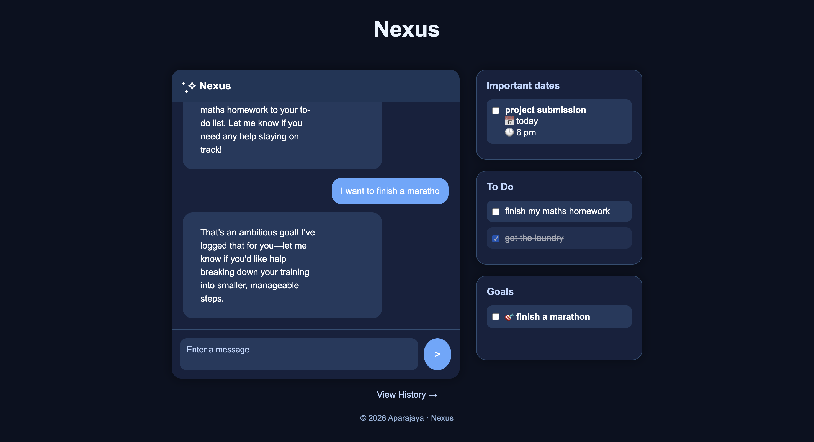
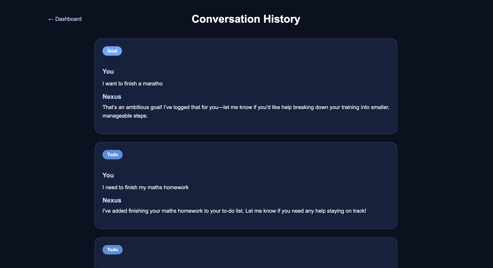

# Nexus – AI Productivity Dashboard

Nexus is an AI-powered productivity dashboard that combines conversational AI with structured task management. Users can chat naturally with the assistant, and Nexus automatically classifies requests into **Todos**, **Deadlines**, **Goals**, or regular conversations, updating the dashboard in real time.

Built using **Flask**, **JavaScript**, **HTML/CSS**, and the **Google Gemini API**.

---

## Features

* 💬 Conversational AI assistant powered by Gemini
* 🧠 AI intent classification into:

  * Todo
  * Deadline
  * Goal
  * Chat
* ⚡ Automatic extraction of structured task information
* 📋 Live dashboard updates without refreshing the page
* 📅 Dedicated sections for:

  * To Do
  * Important Dates
  * Goals
* ✅ Interactive checkboxes for marking tasks as completed
* 📝 Conversation history page
* 🎨 Clean, responsive dark-themed interface

---

## Tech Stack

* Python
* Flask
* HTML5
* CSS3
* JavaScript (Fetch API)
* Google Gemini API (`google-genai`)

---

## Project Structure

```
Nexus/
│
├── static/
│   ├── css/
│   │   ├── style.css
│   │   └── history.css
│   └── js/
│       └── chat.js
│
├── templates/
│   ├── index.html
│   └── history.html
│
├── images/
│   ├── dashboard.png
│   └── history.png
│
├── app.py
├── requirements.txt
├── .env
└── README.md
```

---

## Installation

### 1. Clone the repository

```bash
git clone https://github.com/your-username/Nexus.git
cd Nexus
```

### 2. Create a virtual environment (recommended)

**Windows**

```bash
python -m venv venv
venv\Scripts\activate
```

**macOS / Linux**

```bash
python3 -m venv venv
source venv/bin/activate
```

### 3. Install dependencies

```bash
pip install -r requirements.txt
```

### 4. Configure the Gemini API

Create a `.env` file in the project root:

```env
GEMINI_API_KEY=your_api_key_here
```

Replace `your_api_key_here` with your Google Gemini API key.

### 5. Run the application

```bash
python app.py
```

Open your browser and visit:

```
http://127.0.0.1:5000
```

---

## How It Works

1. The user sends a message through the chat interface.
2. Gemini classifies the message into one of four intents:

   * Todo
   * Deadline
   * Goal
   * Chat
3. Structured information (title, date, time, and details) is extracted as JSON.
4. The frontend instantly updates the corresponding dashboard list.
5. Nexus generates a conversational response based on the detected intent.
6. The interaction is stored in the conversation history.

---

## Demo

A demonstration video is available here:

**https://drive.google.com/drive/folders/1KR7mVJL-LHSxrXoq87u-wBLugBQctHMM?usp=sharing**

---

## Screenshots

### Dashboard



### Conversation History



---

## Future Improvements

* Persistent database storage
* User authentication
* Edit and delete tasks
* Relative date normalization
* Streaming AI responses
* Function calling / tool calling
* Calendar integration
* Notifications and reminders

---

## Requirements

```
Flask
google-genai
python-dotenv
Markdown
```

---

## Author

**Aparajaya**